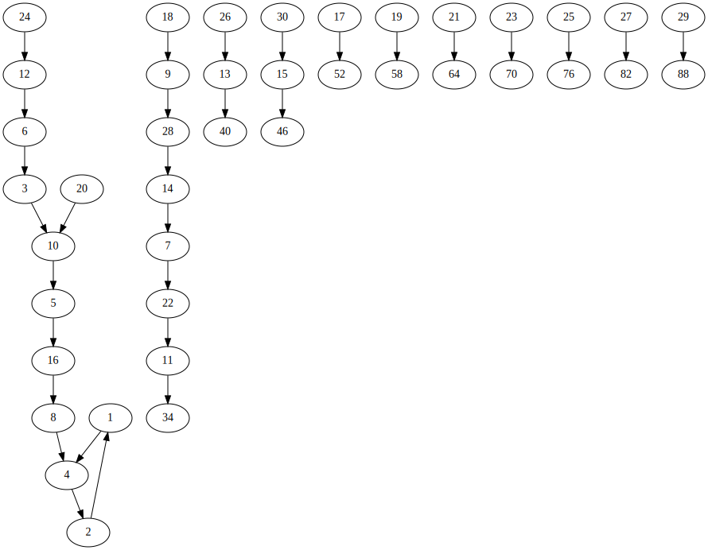

The [Collatz conjecture](https://en.wikipedia.org/wiki/Collatz_conjecture) is a
famous unsolved problem in mathematics concerning the function

```math
f(n) = \begin{cases} n / 2 & n \text{ is even} \\ 3n + 1 & n \text{ is odd} \end{cases}
```

In particular, will successively applying $f$ always eventually reach $1$ for
any $n$? A natural concept that arises when attempting to answer this question
are _chains_. For example,

```math
3 \to 10 \to 5 \to 16 \to 8 \to 4 \to 2 \to 1
```

This repository consists of just a simple binary to automatically generate
graphs of Collatz chains using GraphViz like so:

<p align="center">
  
</p>

We notice that the Collatz graph appears disconnected in our picture. Sadly
though, this does not mean we have found a counterexample to Collatz conjecture;
the components just require nodes with values larger than $30$ to connect!
